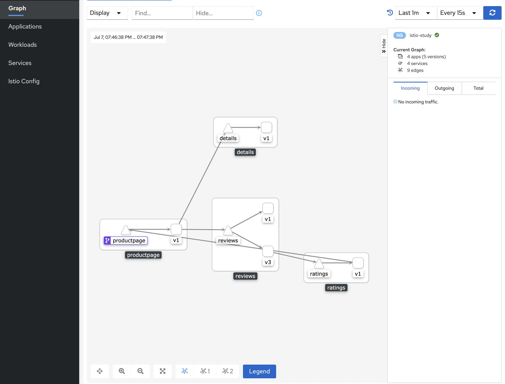

# Istio 环境快速搭建

本文可以帮助你快速搭建和试用Istio。

如果你对 Istio 已经非常熟悉，或者希望部署不同配置的Istio或者一些高级的[部署模型](../chap05/deployment_models.md) 
，可以参考FAQ中[我们应该怎么选择Istio的部署方式](../chap07/setup.md) 。

在搭建 Istio 之前，你首先需要有一个正常运行的 K8s 集群，且 K8s 的版本与 Istio 版本兼容。

|Istio版本|K8s版本|
|-----|--------|
|1.8|1.16, 1.17, 1.18, 1.19|
|1.9|1.17, 1.18, 1.19, 1.20|
|1.10|1.18, 1.19, 1.20, 1.21|


下面，我们将按照如下步骤来开始使用 Istio:

1. 下载并安装Istio
2. 部署示例应用程序
3. 对外开放应用程序
4. 查看仪表盘

## 下载Istio

**Step1**

转到 [Istio 发布页面](https://github.com/istio/istio/releases/tag/1.8.3) ，下载针对你操作系统的安装文件。

或者也可以用自动化工具下载并提取最新版本（Linux 或 macOS）：

```shell
curl -L https://istio.io/downloadIstio | ISTIO_VERSION=1.8.3 TARGET_ARCH=x86_64 sh -
```

**Step2**

```shell
cd ./istio-1.8.3
```

在该目录下包含如下内容：

 - 示例应用文件: samples/ 目录下。
 - istioctl 客户端: bin/ 目录下。
 - istio 配置相关配置文件: manifests/ 目录下。


**Step3**

将 istioctl 客户端所在目录添加至 PATH 环境变量中：

```shell
export PATH=$PWD/bin:$PATH
```

## 安装Istio

接下来，我们使用 demo 的 [配置](./config_profiles.md) 来进行 istio 的安装。

Ps: demo 的配置其实是一组专为测试/学习准备的功能集合，对于生产环境或性能要求较高的环境，建议选择其他配置。

```shell
istioctl install --set profile=demo -y
# ✔ Istio core installed
# ✔ Istiod installed
# ✔ Egress gateways installed
# ✔ Ingress gateways installed
# ✔ Installation complete
```

当Istio安装完成后，我们还可以指定一些 namespace 可以默认自动注入 Envoy Sidecar 从来实现流量代理。

```shell
kubectl label namespace default istio-injection=enabled
# namespace/default labeled
```


## 部署示例应用程序

当 Istio 部署完成后，我们就可以开始部署我们的示例应用程序了。

下面，我们以 [书店应用程序](../chap04/bookinfo.md) 为例进行演示。

```shell
kubectl apply -f samples/bookinfo/platform/kube/bookinfo.yaml
```

接下来，我们就要等待 bookinfo 中的每个 Pod 部署完成了，在部署的过程中，Istio 的 Sidecar 也会自动进行部署。

我们可以通过如下命令来查询部署的状态：

```shell
kubectl get services
kubectl get pods
# NAME                              READY   STATUS    RESTARTS   AGE
# details-v1-5974b67c8-cq9vs        2/2     Running   0          3h28m
# productpage-v1-64794f5db4-b9rdd   2/2     Running   0          3h28m
# ratings-v1-c6cdf8d98-8wpfx        2/2     Running   0          3h28m
# reviews-v1-7f6558b974-88z5n       2/2     Running   0          3h28m
# reviews-v2-6cb6ccd848-jk65m       2/2     Running   0          3h28m
# reviews-v3-cc56b578-wm5xl         2/2     Running   0          3h28m
```

Ps: 再执行后续操作之前，需要先保证你的所有Pod都已经可以正常运行起来了。

下面，我们也可以通过运行如下命令来进行检查服务是否已经正常运行了：

```shell
kubectl exec "$(kubectl get pod -l app=ratings -o jsonpath='{.items[0].metadata.name}')" -c ratings -- curl -s productpage:9080/productpage | grep -o "<title>.*</title>"
# <title>Simple Bookstore App</title>
```

## 对外开放应用程序

此时，bookinfo 应用其实在 K8s 集群中正常部署好了，但是它还不能被外部的服务进行访问。

为了让它可以被正常访问，我们需要创建一个 [Istio 入口网关](../chap01/traffic_management.md) ，它会在服务网格边缘把一个路径映射到我们的服务上。

```shell
kubectl apply -f samples/bookinfo/networking/bookinfo-gateway.yaml
# gateway.networking.istio.io/bookinfo-gateway created
# virtualservice.networking.istio.io/bookinfo created
```

接下来，我们可以使用 istioctl 工具来验证一下我们的配置是否正常:

```shell
istioctl analyze
```

下面，我们来查一下我们入口网关的IP和端口。

首先，查询一下入口网关的HOST_IP：

```shell
export INGRESS_HOST=$(kubectl get po -l istio=ingressgateway -n istio-system -o jsonpath='{.items[0].status.hostIP}')
echo $INGRESS_HOST
```

它其实就是 ingressgateway Pod 所在的机器IP。

下面，我们再来查询一下入口网关的端口：

```shell
export INGRESS_PORT=$(kubectl -n istio-system get service istio-ingressgateway -o jsonpath='{.spec.ports[?(@.name=="http2")].nodePort}')
echo $INGRESS_PORT
export SECURE_INGRESS_PORT=$(kubectl -n istio-system get service istio-ingressgateway -o jsonpath='{.spec.ports[?(@.name=="https")].nodePort}')
echo $SECURE_INGRESS_PORT
```

查询到了入口网关的IP和端口，那么，接下来，我们就可以组装得到入口网关的地址了：

```shell
export GATEWAY_URL=$INGRESS_HOST:$INGRESS_PORT
echo "$GATEWAY_URL"
```

为了验证该服务是否可以被外部服务正常访问，我们可以组装得到希望访问的URL，然后使用你的 WEB 浏览器打开看看吧：

```shell
echo "http://$GATEWAY_URL/productpage"
```


## 查看仪表盘

Istio 内置集成了一系列遥测相关的应用。
这些遥测服务可以帮助我们理解服务网格的结构、展示网络的拓扑结构、分析网格的健康状态等。

下面，我们来部署一下 [kiali](../chap05/kiali.md) 仪表盘。

```shell
kubectl apply -f samples/addons
kubectl rollout status deployment/kiali -n istio-system
# Waiting for deployment "kiali" rollout to finish: 0 of 1 updated replicas are available...
# deployment "kiali" successfully rolled out
```

Ps: `kubectl apply` 指令在第一次执行时，如果有一些 no matches for kind 类相关的报错的话，只需要再次重复执行一下即可，它们有时候和一些先后顺序有关。

完成 kiali 的部署后，我们可以给 kiali 提供一个访问入口：

```shell
istioctl dashboard kiali
# http://localhost:20001/kiali
```

上述命令可以申请一个端口，可以用于直接访问 kiali Dashboard页面。

进入 kiali Dashboard 页面后，在左侧的导航菜单，选择 Graph ，然后在 Namespace 下拉列表中，选择 default 。

Kiali 仪表板展示了网格的概览、以及 Bookinfo 示例应用的各个服务之间的关系。 它还提供过滤器来可视化流量的流动。



## 接下来

到此为止，我们其实就已经完成了 Istio 的环境搭建和体验。

对于新手来说，这些任务是非常好的资源，可以借助 demo 安装更深入了解 Istio 的特性：

- [请求路由](../chap03/request_routing.md)
- [故障注入](../chap03/fault_injection.md)
- [流量切换](../chap03/traffic_shifting.md)
- [查询指标](../chap03/metrics.md)
- [可视化指标](../chap03/metrics.md)
- [访问外部服务](../chap03/egress.md)
 - [可视化网格](../chap03/visualizing_mesh.md)

在你在生产环境使用 Istio 之前，请务必先阅读如下资源：

 - [部署模型](../chap05/deployment_models.md)
 - [部署的最佳实践](../chap05/deployment_best_practice.md)
 - [Pod 的需求](../chap05/requirements.md)

## 移除 Istio

删除 Bookinfo 示例应用和配置, 参阅 [删除Bookinfo](../chap04/bookinfo.md) .

Istio 卸载程序按照层次结构逐级的从 istio-system 命令空间中删除 RBAC 权限和所有资源。对于不存在的资源报错，可以安全的忽略掉，毕竟他们已经被分层的删除了。

```shell
kubectl delete -f samples/addons
istioctl manifest generate --set profile=demo | kubectl delete --ignore-not-found=true -f -
```

命名空间 istio-system 默认情况下并不会被删除。 不需要的时候，使用下面命令删掉它：

```shell
kubectl delete namespace istio-system
```

指示 Istio 自动注入 Envoy 边车代理的标签默认也不删除。 不需要的时候，使用下面命令删掉它。

```shell
kubectl label namespace default istio-injection-
```
